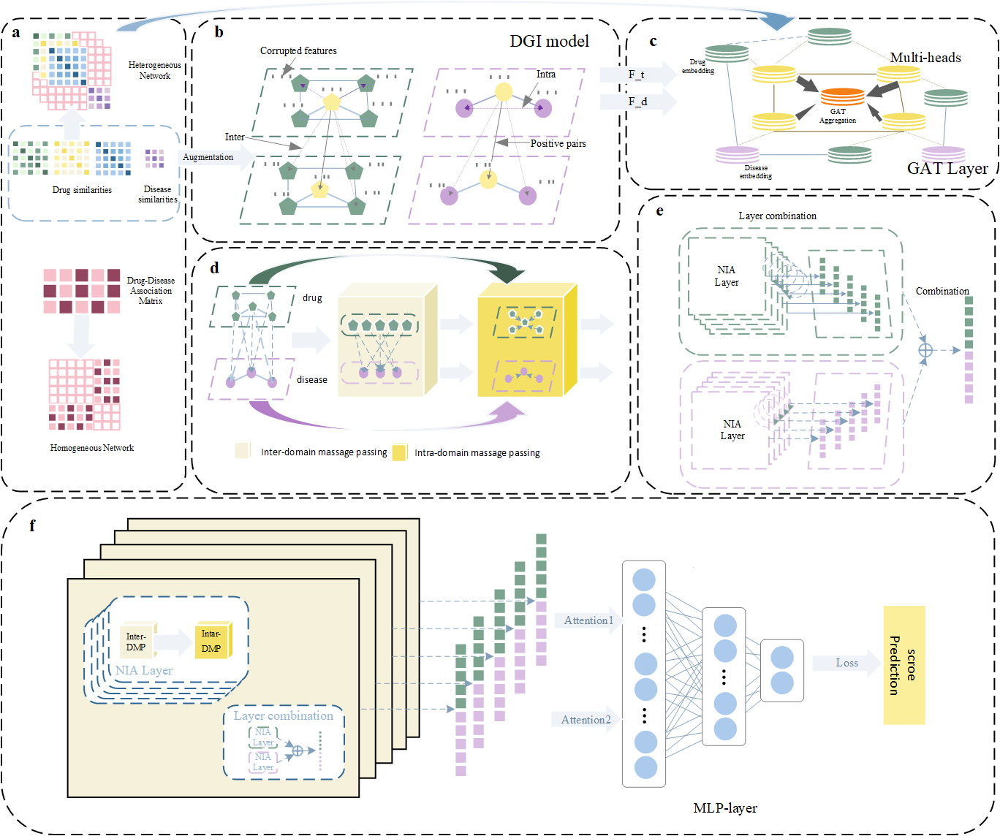

# GATPDD: A Deep Learning-Based Computational Method to Improve Parasitic Disease Therapy Prediction

## Introduction
GATPDD is a deep learning-based model integrating enhanced feature learning and multi-head Graph Attention Networks (GAT) to accurately predict drug-parasitic disease associations, aiding therapeutic discovery and repurposing.

## Framework



## Environment Setup
### System Requirements
GATPDD is implemented in Python 3.10 using PyTorch 1.13.1. The following are the required dependencies:

```
numpy==1.23.1
pandas==2.2.3
python==3.10.16
scikit-learn==1.1.2
scipy==1.15.2
torch==1.13.1+cu117
```

### Installation Guide
```
# Clone the repository
$ git clone https://github.com/IamChenHailin/GATPDD.git
$ cd GATPDD
```

## Dataset
The dataset used in this study can be downloaded from the following link:
[Download Dataset](https://drive.google.com/file/d/1EJvNJxOJJO8K06OKeC5J4W6iDYEloTur/view?usp=sharing)
After downloading, place the dataset file into the directory:
./GATPDD/Datasets/datasetname/used_data, for example, ./GATPDD/Datasets/ZhangDDA/used_data
## Parameters
### Modifying Run Parameters
GATPDD supports multiple experiment modes, which can be specified using the `--exp_name` argument in `command_optimal.py`. Supported modes include:

- `optimal_cross`: 5-fold cross-validation
- `optimal_indent`: independent testing
- `mid_dim`, `num_layer`, `alp_beta`: hyperparameter tuning modes

#### **1. split_data.py**
Example usage:
```
python split_data.py 5 ZhangDDA 1 1
```

#### **2. command_optimal.py**
Example usage:
```
python command_optimal.py --dataName ZhangDDA --exp_name optimal_cross --seed_cross 1 --seed_indent 1 --device cuda
```

## Execution
### **Step 1: Split the dataset**
```
python split_data.py
```

### **Step 2: Train the optimal model**
```
python command_optimal.py
```

